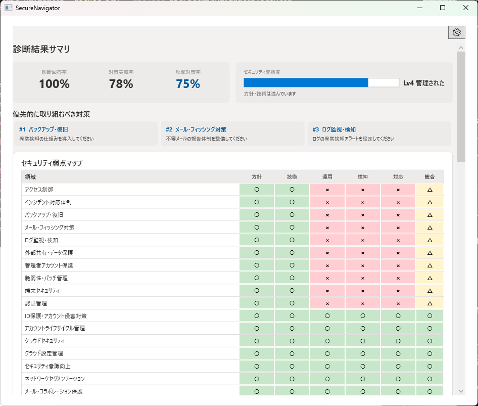
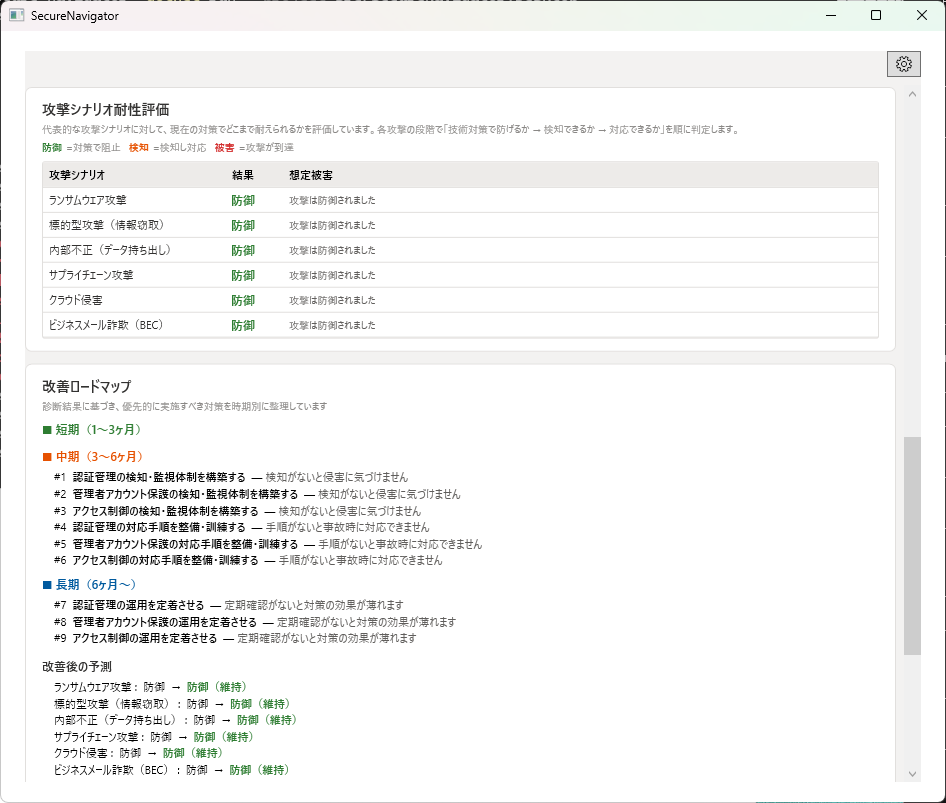
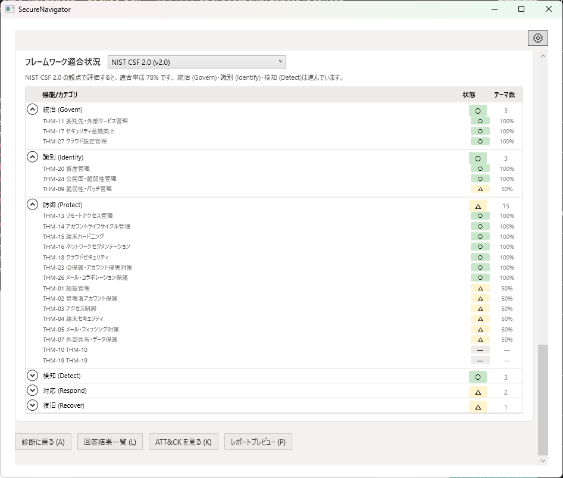
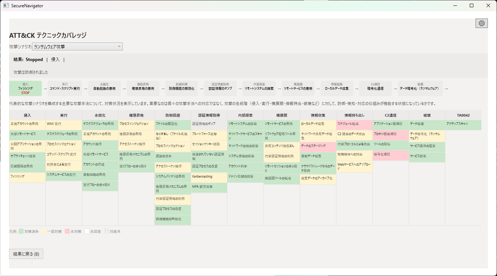
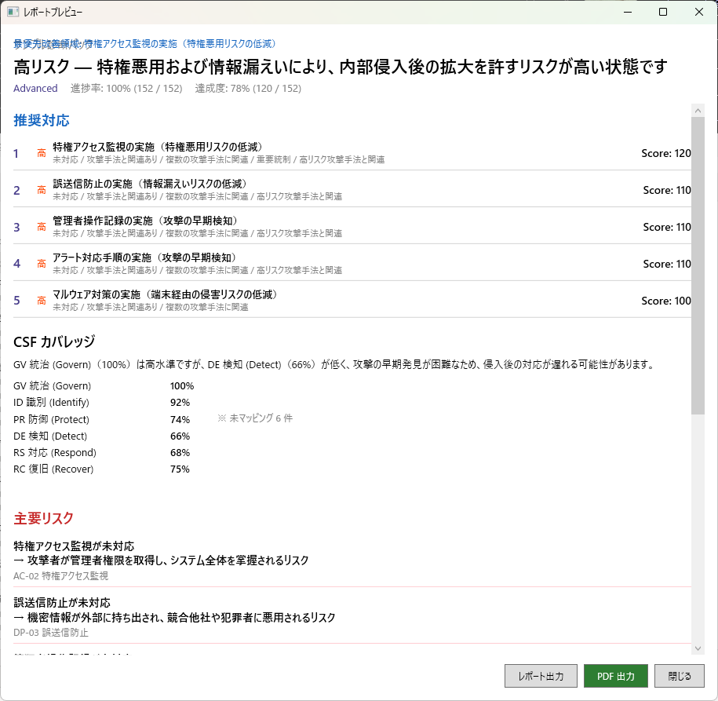

# SecureNavigator

セキュリティ対策を攻撃視点とガイドラインで整理し、レポートへ変換するオフライン評価ツール

[English version](README_en.md)

---

## SecureNavigator とは

SecureNavigator は、組織のセキュリティ対策状況を攻撃者の視点から分析し、想定攻撃に対する防御上の弱点を整理するオフライン評価ツールです。MITRE ATT&CK ベースの6つの攻撃シナリオに対して防御力を分析し、IPA 中小企業向けガイドライン・経産省サイバーセキュリティ経営ガイドライン・NIST CSF 2.0 に対する適合状況を整理します。改善の優先順位をロードマップとして提示し、説明・報告・改善検討に使えるレポートを生成します。すべての処理はローカルで完結し、外部にデータを送信しません。

## 想定利用者

- **情シス担当者** — セキュリティ対策状況を整理し、社内報告用の資料を作成する
- **セキュリティ担当者** — 防御上の弱点を特定し、改善の優先順位を検討する
- **中小企業の管理者** — 専門知識がなくても組織のセキュリティ状況を把握する
- **セキュリティ改善の説明・報告が必要な方** — 経営層や上長への説明資料を生成する

## 主な特徴

- **完全オフライン** — 診断データはローカルにのみ保存。外部通信・テレメトリ・クラウド依存なし
- **攻撃シナリオ分析** — MITRE ATT&CK ベースの6つの攻撃シナリオで、防御力をステップごとに分析
- **複数ガイドライン対応** — IPA は Free で利用可能。経産省ガイドラインと NIST CSF 2.0 は Pro で利用可能
- **改善ロードマップ** — 「今すぐ」「短期」「中期」「長期」の4段階で優先対策を提示
- **レポート出力** — PDF、HTML、Markdown で診断結果を出力 [Pro]
- **高度な分析** — 成熟度詳細・原因と対策テーブル・ATT&CK テクニック詳細分析 [Pro]
- **日本語 / 英語** — 診断・レポートともに日本語と英語に対応

## Free / Pro 比較

| 機能 | Free | Pro |
|------|:----:|:---:|
| 診断（全問回答） | ✓ | ✓ |
| 攻撃シナリオシミュレーション | ✓ | ✓ |
| 改善ロードマップ（画面表示） | ✓ | ✓ |
| IPA 中小企業向けガイドライン適合評価 | ✓ | ✓ |
| 経産省サイバーセキュリティ経営ガイドライン適合評価 | — | ✓ |
| NIST CSF 2.0 適合評価 | — | ✓ |
| 高度な分析（成熟度詳細・原因と対策） | — | ✓ |
| ATT&CK テクニック詳細分析 | — | ✓ |
| PDF レポート出力 | — | ✓ |
| HTML / Markdown レポート出力 | — | ✓ |
| ヒアリングシート出力（Excel） | — | ✓ |
| 日本語 / 英語切替 | ✓ | ✓ |
| セッション保存数 | 1件 | 3件 |

## ユースケース

- **定期的なセキュリティレビュー** — その時点の防御状況を整理し、優先対策を明確にする
- **経営層への報告** — セキュリティ状況・弱点・推奨対策を報告資料として整理する
- **改善の優先順位検討** — ロードマップを使って、どの対策から着手すべきかを判断する
- **ガイドライン適合評価** — IPA・経産省・NIST CSF 2.0 に対する適合状況を確認する

## プライバシーとオフライン動作

SecureNavigator は完全オフラインで動作します。外部サーバーへの接続、診断データの送信、テレメトリや分析のためのデータ収集は一切行いません。診断回答・評価結果・アプリ設定はすべて `%LocalAppData%\SecureNavigator\` に保存されます。ネットワーク通信が発生するのは Microsoft Store 経由のインストール・更新のみであり、これはアプリではなく OS の機能です。

## スクリーンショット

### 診断結果サマリ

### 攻撃シナリオ耐性評価 / 改善ロードマップ

### フレームワーク適合状況（NIST CSF 2.0）

### ATT&CK テクニックカバレッジ（Pro）

### レポートプレビュー（Pro）

## リンク

| | |
|---|---|
| 製品サイト | https://secure-navigator.sumikkolab.com/ |
| マニュアル | https://secure-navigator.sumikkolab.com/manual/ |
| プライバシーポリシー | https://secure-navigator.sumikkolab.com/privacy-policy.html |
| 利用規約 | https://secure-navigator.sumikkolab.com/terms-of-use.html |
| サポート | https://secure-navigator.sumikkolab.com/support.html |

## 動作要件

- Windows 10 Version 2004 以降 / Windows 11
- WebView2 Runtime（PDF 出力に必要。通常は OS に同梱済み）
- ディスク容量: 約 50 MB
- インターネット接続: 不要（完全オフライン動作）

## ライセンス

SecureNavigator はプロプライエタリソフトウェアです。Free 版と Pro 版を提供しています。

- **Free** — 個人または組織内部での自己点検・評価体験
- **Pro** — 組織内部での評価・報告・改善検討
- 利用者自身の組織以外に対する商用利用には、当該利用形態に対応した別途のライセンスが必要です

詳細は[利用規約](https://secure-navigator.sumikkolab.com/terms-of-use.html)をご確認ください。

---

© 2026 Sumikko Lab. All rights reserved.
